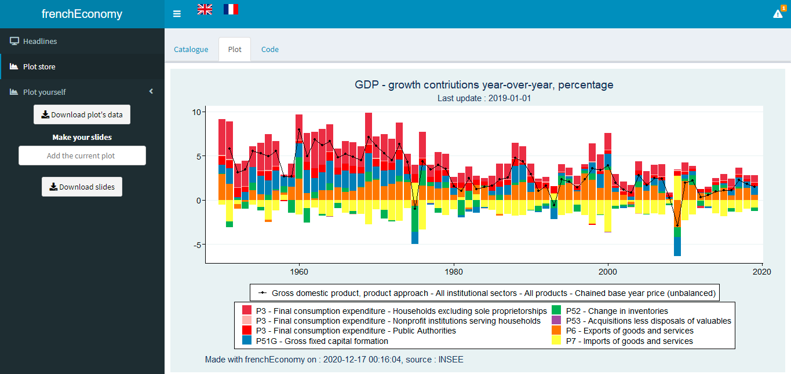

graffiti R package
================

## Overview

*Experimental*

This package contains an R-Shiny Dashboard Displaying Data From INSEE.
This dashboard contains a library of pre-made plots and a plot generator.

This package is a contribution to reproducible research and public data transparency.

## Installation, Loading an Use

``` r
# Get the development version from GitHub
# install.packages("devtools")
# devtools::install_github("pyr-opendatafr/R-Insee-Data")
# devtools::install_github("pyr-opendatafr/graffiti")

library(graffiti)

# Use
graffiti()

```

## Dashboard




## Contributing

All contributions are welcome !!

## Support

Feel free to open an issue with any question about this package using <https://github.com/pyr-opendatafr/graffiti/issues> Github repository.
